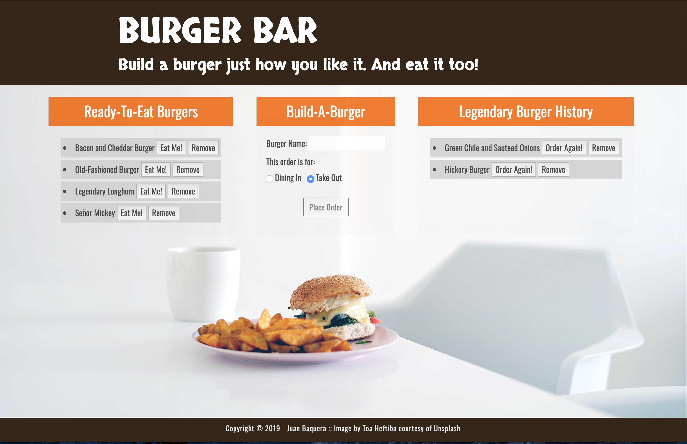

# Node Express Handlebars
## Burger App



### Overview
This assignment required the creation of a "'burger" logger using MySQL, Node, Express, Handlebars and a homemade ORM. The assignment follows the MVC design pattern; uses Node and MySQL to query and route data in the app, and Handlebars to generate the HTML.


### How To Use the App
* BURGER BAR is a restaurant app that lets users input the names of burgers they'd like to eat. This is accomplished under the "Build-A-Burger" card header where a user can enter a burger name in the field and click the `Place Order` button to "submit" their order to the kitchen.

* Whenever a user submits a burger's name, the app will display the burger on the left side of the page -- within the "Ready-To-Eat Burgers" card header and body. Users can remove burgers from this list by clicking the `Remove` button. This will delete the entry from the database via the burger id.

* Each burger in the waiting area also has an `Eat Me!` button. When the user clicks it, the burger will move to the right side of the page under the "Legendary Burger History" card header. This way users can store their favorite burgers. If they like they can click the `Order Again` button to re-order the burger -- this moves the burger back over to the left-hand "Ready-To-Eat Burgers". Users can remove burgers from this list as well by clicking the `Remove` button. This will delete the entry from the database via the burger id.

* The app will store every burger in a database, whether eaten or not.

- - -
## Project Set-up

#### App Setup
1. Installed: `npm install express`, `npm install express-handlebars`, `npm install mysql`.

2. Required the following npm packages inside of the `server.js` file.


#### DB Setup
1. The `db` folder contains a `schema.sql` file with SQL queries that do the following:
   * Create the `burgers_db`.
   * Switch to or use the `burgers_db`.
   * Create a `burgers` table with these fields:
     * **id**: an auto incrementing int that serves as the primary key.
     * **burger_name**: a string.
     * **devoured**: a boolean.

2. In the `db` folder is a `seeds.sql` file that contains insert queries to populate the `burgers` table with entries.


#### Config Setup
1. A `connection.js` file was created inside `config` directory.
   * The `connection.js` file, sets up the code to connect Node to MySQL.
   * And export the connection.

2. Created an `orm.js` file inside the `config` directory.
   * Import (require) `connection.js` into `orm.js`
   * In the `orm.js` file, created the methods that execute the necessary MySQL commands in the controllers. The methods used to retrieve and store data in your database.
     * `selectAll()`
     * `insertOne()`
     * `updateOne()`
     * `deleteOne()`
   * Export the ORM object in `module.exports`.


#### Model setup
* Inside `models`, is a `burger.js` file that imports `orm.js` into `burger.js`
    * Inside `burger.js`, also created the code that calls the ORM functions using "'burger" specific input for the ORM.
    * Export at the end of the `burger.js` file.


#### Controller setup
1. Inside `controllers`, was created a `burgers_controller.js` file.

2. The `burgers_controller.js` file, imports the following:
   * Express
   * `burger.js`

3. Created the `router` for the app, and export the `router` at the end of the file.


#### View setup
1. Created the `index.handlebars` file inside `views` directory.
   * Created the `layouts` directory inside `views` directory.
     * Created the `main.handlebars` file inside `layouts` directory.
     * Setup the `main.handlebars` file so it's able to be used by Handlebars.
     * Setup the `index.handlebars` to have the template that Handlebars can render onto.
     * Created a button in `index.handlebars` that will submit the user input into the database.


#### Directory structure
All the recommended files and directories from the steps above are represented with the following structure:

```
.
├── config
│   ├── connection.js
│   └── orm.js
│ 
├── controllers
│   └── burgers_controller.js
│
├── db
│   ├── schema.sql
│   └── seeds.sql
│
├── models
│   └── burger.js
│ 
├── node_modules
│ 
├── package.json
│
├── public
│   └── assets
│       ├── css
│       │   └── burger_style.css
│       └── img
│           └── burger.png
│   
│
├── server.js
│
└── views
    ├── index.handlebars
    └── layouts
        └── main.handlebars
```

- - -